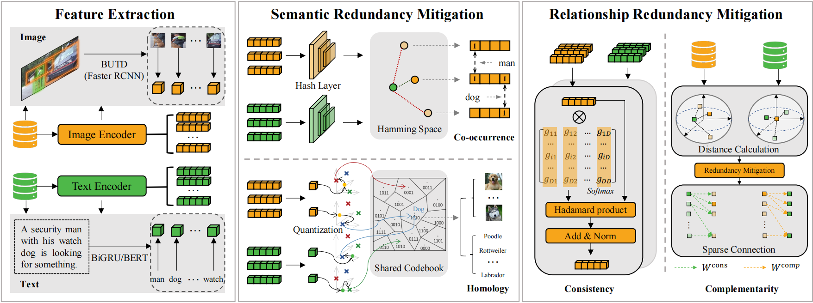

# Redundancy Mitigation: Towards Accurate and Efficient Image-Text Retrieval (TCSVT 2025)

> TCSVT 2025 paper on semantic and relationship redundancy mitigation for accurate and efficient image-text retrieval.

## Authors

**Kun Wang**<sup>1</sup>, **Yupeng Hu**<sup>1</sup>, **Hao Liu**<sup>1</sup>, **Lirong Jie**<sup>1</sup>, **Liqiang Nie**<sup>2</sup>

<sup>1</sup> School of Software, Shandong University, Jinan, China  
<sup>2</sup> School of Computer Science and Technology, Harbin Institute of Technology, Shenzhen, China

## Links

- **Paper**: [Redundancy Mitigation: Towards Accurate and Efficient Image-Text Retrieval](https://ieeexplore.ieee.org/document/11299108)

---

## Table of Contents

- [Updates](#updates)
- [Introduction](#introduction)
- [Highlights](#highlights)
- [Method Overview](#method-overview)
- [Project Structure](#project-structure)
- [Installation](#installation)
- [Checkpoints](#checkpoints)
- [Dataset](#dataset)
- [Usage](#usage)
- [Results](#results)
- [Citation](#citation)
- [Acknowledgement](#acknowledgement)
- [License](#license)
- [Contact](#contact)
---

## Updates

- [04/2026] Initial public code release.

---

## Introduction

This repository contains the implementation of **Redundancy Mitigation: Towards Accurate and Efficient Image-Text Retrieval** (TCSVT 2025).

Existing Image-Text Retrieval (ITR) methods often suffer from a fundamental yet overlooked challenge: redundancy, which manifests as both semantic redundancy within unimodal representations and relationship redundancy in cross-modal alignments. MEET introduces an iMage-text retrieval rEdundancy miTigation framework to explicitly analyze and address the ITR problem from a redundancy perspective. This approach mitigates semantic redundancy by repurposing deep hashing and quantization , and progressively refines the cross-modal alignment space by filtering misleading negative samples and adaptively reweighting informative pairs , helping the model effectively produce compact yet highly discriminative representations for accurate and efficient retrieval.

This repository currently provides:

- Training code
- Training utilities and scripts


---

## Highlights

- Accurate and efficient Image-Text Retrieval (ITR) explicitly tackled from a novel redundancy mitigation perspective.
- Semantic Redundancy Mitigation (via deep hashing and quantization) + Relationship Redundancy Mitigation (progressive filtering and adaptive reweighting).
- Support for end-to-end model training, diverse feature encoders, and unified optimization.

---

## Method Overview



---

## Project Structure

```text
|-- at/                            # Implementation for BiGRU features
|   |-- __pycache__/               # Compiled Python files (auto-generated)
|   |-- lib/                       # Core library and utility scripts
|   |-- modelzoos/                 # Model architectures and definitions
|   |-- arguments.py               # Configuration and hyperparameter settings
|   |-- graph_lib.py               # Graph-related operations and functions
|   |-- hq_train.py                # Main training script
|   |-- where_cuda                 # CUDA device configuration
|
|-- at_bert/                       # Implementation for BERT features
|   |-- __pycache__/               # Compiled Python files (auto-generated)
|   |-- lib/                       # Core library and utility scripts
|   |-- arguments.py               # Configuration and hyperparameter settings
|   |-- environment.yml            # Conda environment dependencies
|   |-- graph_lib.py               # Graph-related operations and functions
|   |-- hq_train.py                # Main training script
|   |-- where_cuda                 # CUDA device configuration
```

---

## Installation

### 1. Clone the repository

```bash
git clone https://github.com/iLearn-Lab/TCSVT25-MEET.git
cd MEET
```

### 2. Create environment

```bash
python >= 3.8
torch >= 1.7.0
torchvision >= 0.8.0
transformers >=2.1.1
opencv-python
tensorboard
```
 


---

## Checkpoints

The cloud links of checkpoints: [Google Drive](https://drive.google.com/drive/folders/1_ycDD1sBZwYa97m8SyKEnV4PdhRLas89?usp=sharing) & [Hugging Face](https://huggingface.co/iLearn-Lab/TCSVT25-MEET).


---

## Dataset

We need get the pretrained checkpoint files for [BERT-base](https://huggingface.co/bert-base-uncased) model. 
We need to get the pretrained checkpoint files for a VSE (Visual-Semantic Embedding) model. You can choose any VSE model; here, we provide the [ESA](https://github.com/KevinLight831/ESA) model as an example.
We use MSCOCO and Flickr30K datasets and splits produced by [HREM](https://github.com/crossmodalgroup/hrem). 

```
data
├── coco_precomp         # coco dataset
│   ├── train_ims.npy
│   ├── train_caps.txt
│   ├── dev_ims.npy
│   ├── dev_caps.txt
│   ├── testall_ims.npy
│   ├── testall_caps.txt
│   └── ......
│
├── f30k_precomp         # f30k dataset
│   ├── train_ims.npy
│   ├── train_caps.txt
│   ├── dev_ims.npy
│   ├── dev_caps.txt
│   ├── test_ims.npy
│   ├── test_caps.txt
│   └── ......
│
├── bert-base-uncased    # the pretrained ckpt files for BERT-base
│   ├── config.json
│   ├── tokenizer_config.txt
│   ├── vocab.txt
│   ├── pytorch_model.bin
│   └── ......
│
├── vocab                # vocabulary files and word embedding cache
│   ├── .vector_cache/
│   ├── coco_precomp_vocab.json
│   └── f30k_precomp_vocab.json
│
└── VSE                  # VSE model outputs or checkpoints
    ├── coco_butd_region_bert1/
    ├── coco_butd_region_bigru_525.3.../
    ├── f30k_butd_region_bert1/
    └── f30k_butd_region_bigru_514.7/
```
---

## Usage
Depending on the text features you are using, open the corresponding script: use `at/lib/test.py` for **BiGRU** features, or `at_bert/lib/test.py` for **BERT** features.

To evaluate on the MSCOCO 1K 5-fold splits, please generate the folds using the following script:
```bash
python scripts/make_coco_1k_folds.py
```

### Train
Make sure to specify the dataset name (`coco_precomp` or `f30k_precomp`) after the `--data_name` flag:

```bash
PYTHONPATH=. python hq_train.py --num_epochs 12 --batch_size 128 --workers 8 --H 64 --M 8 --K 8 --data_name <dataset_name>
```

### Eval
Put the checkpoints in `LOGGER_PATH`. Next, open `at/lib/test.py` or `at_bert/lib/test.py` and modify the `RUN_PATH`. Finally, run the following commands (make sure to change `MODEL_PATH` to the VSE weights of the corresponding dataset):
```bash
PYTHONPATH=. python -m lib.test
```
---


## Results

Selected strong baselines from Table I and Table II in the paper are listed below.

### Table I. Flickr30K, BUTD + Bi-GRU

| Method | I2T R@1 | I2T R@5 | I2T R@10 | T2I R@1 | T2I R@5 | T2I R@10 | rSum |
| --- | ---: | ---: | ---: | ---: | ---: | ---: | ---: |
| HREM | 79.5 | 94.3 | 97.4 | 59.3 | 85.1 | 91.2 | 506.8 |
| CHAN | 79.7 | 94.5 | 97.3 | 60.2 | 85.3 | 90.7 | 507.8 |
| IMEB | 80.0 | 96.0 | 98.1 | 60.0 | 85.9 | 91.5 | 511.5 |
| TVRN | 79.7 | 95.4 | 97.6 | 62.3 | 85.3 | 90.6 | 510.9 |
| MAMET | 78.8 | 95.5 | 97.9 | 58.3 | 83.8 | 90.0 | 504.3 |
| **MEET** | **84.4** | **96.1** | **98.3** | **64.9** | **87.2** | **91.6** | **522.5** |

### Table I. MS-COCO (1K), BUTD + Bi-GRU

| Method | I2T R@1 | I2T R@5 | I2T R@10 | T2I R@1 | T2I R@5 | T2I R@10 | rSum |
| --- | ---: | ---: | ---: | ---: | ---: | ---: | ---: |
| HREM | 80.0 | 96.0 | 98.7 | 62.7 | 90.1 | 95.4 | 522.8 |
| CHAN | 79.7 | 96.7 | 98.7 | 63.8 | 90.4 | 95.8 | 525.0 |
| IMEB | 81.0 | 96.6 | 98.8 | 64.1 | 90.8 | 95.9 | 527.2 |
| TVRN | 79.7 | 96.0 | 98.6 | 64.2 | 90.7 | 96.1 | 525.3 |
| MAMET | 79.0 | 96.4 | 98.8 | 63.0 | 90.7 | 96.3 | 524.2 |
| **MEET** | **82.7** | **96.9** | **99.1** | **65.8** | **91.3** | **96.3** | **532.1** |

### Table I. Flickr30K, BUTD + BERT

| Method | I2T R@1 | I2T R@5 | I2T R@10 | T2I R@1 | T2I R@5 | T2I R@10 | rSum |
| --- | ---: | ---: | ---: | ---: | ---: | ---: | ---: |
| HREM | 83.3 | 96.0 | 98.1 | 63.5 | 87.1 | 92.4 | 520.4 |
| CHAN | 80.6 | 96.1 | 97.8 | 63.9 | 87.5 | 92.6 | 518.5 |
| IMEB | 84.2 | 96.7 | 98.4 | 64.0 | 88.0 | 92.8 | 524.1 |
| TVRN | 82.1 | 95.6 | 98.3 | 63.9 | 87.6 | 92.6 | 520.1 |
| MAMET | 83.1 | 97.0 | 98.6 | 63.2 | 87.1 | 92.2 | 521.2 |
| **MEET** | **87.8** | **97.7** | **98.7** | **67.8** | **88.4** | **93.0** | **533.4** |

### Table I. MS-COCO (1K), BUTD + BERT

| Method | I2T R@1 | I2T R@5 | I2T R@10 | T2I R@1 | T2I R@5 | T2I R@10 | rSum |
| --- | ---: | ---: | ---: | ---: | ---: | ---: | ---: |
| HREM | 81.1 | 96.6 | 98.9 | 66.1 | 91.6 | 96.5 | 530.8 |
| CHAN | 81.4 | 96.9 | 98.9 | 66.5 | 92.1 | 96.7 | 532.5 |
| IMEB | 82.4 | 96.9 | 99.0 | 66.7 | 91.9 | 96.6 | 533.5 |
| TVRN | 81.1 | 96.4 | 98.8 | 67.7 | 92.3 | 97.1 | 533.4 |
| MAMET | 82.1 | 96.7 | 99.0 | 67.0 | 92.2 | 96.6 | 533.6 |
| **MEET** | **83.1** | **97.5** | **99.1** | **68.3** | 91.8 | 96.2 | **536.0** |

### Table II. MS-COCO (5K), BUTD + Bi-GRU

| Method | I2T R@1 | I2T R@5 | I2T R@10 | T2I R@1 | T2I R@5 | T2I R@10 | rSum |
| --- | ---: | ---: | ---: | ---: | ---: | ---: | ---: |
| HREM | 58.9 | 85.3 | 92.1 | 40.0 | 70.6 | 81.2 | 428.1 |
| CHAN | 60.2 | 85.9 | 92.4 | 41.7 | 71.5 | 81.7 | 433.4 |
| IMEB | 60.4 | 86.3 | 92.6 | 41.8 | 72.1 | 82.2 | 435.4 |
| TVRN | 59.2 | 84.6 | 91.6 | 42.5 | 71.8 | 82.1 | 431.8 |
| MAMET | 57.7 | 85.6 | 92.0 | 41.4 | 70.9 | 81.6 | 429.2 |
| **MEET** | **61.4** | **86.5** | 92.0 | **43.8** | **73.6** | **83.3** | **440.6** |

### Table II. MS-COCO (5K), BUTD + BERT

| Method | I2T R@1 | I2T R@5 | I2T R@10 | T2I R@1 | T2I R@5 | T2I R@10 | rSum |
| --- | ---: | ---: | ---: | ---: | ---: | ---: | ---: |
| HREM | 62.3 | 87.6 | 93.4 | 43.9 | 73.6 | 83.3 | 444.1 |
| CHAN | 59.8 | 87.2 | 93.3 | 44.9 | 74.5 | 84.2 | 443.9 |
| IMEB | 62.8 | 87.8 | 93.5 | 44.9 | 74.6 | 84.0 | 447.6 |
| TVRN | 61.1 | 86.3 | 92.5 | 45.5 | 75.0 | 84.8 | 445.2 |
| MAMET | 63.0 | 87.7 | 93.9 | 45.6 | 74.9 | 84.1 | 449.2 |
| **MEET** | **64.7** | **88.7** | **93.9** | **47.2** | **76.0** | **85.0** | **455.5** |

More complete comparisons can be found in Table I and Table II of the paper.

---

## Citation

```bibtex
@article{wang2025redundancy,
  title={Redundancy Mitigation: Towards Accurate and Efficient Image-Text Retrieval},
  author={Wang, Kun and Hu, Yupeng and Liu, Hao and Jie, Lirong and Nie, Liqiang},
  journal={IEEE Transactions on Circuits and Systems for Video Technology},
  year={2025},
  publisher={IEEE}
}
```

---

## Acknowledgement

- Thanks to the [HREM](https://github.com/crossmodalgroup/hrem) open-source community for strong baselines and tooling.
- Thanks to all collaborators and contributors of this project.

---

## License

This project is released under the Apache License 2.0.

---

# Contact
**If you have any questions, feel free to contact me at khylon.kun.wang@gmail.com**.
